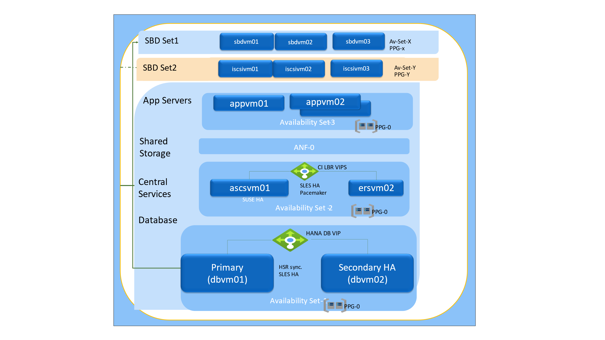

Contents {#contents .TOCHeading}
========

[Abstract](#abstract)

[Architecture](#architecture)

[Document Links](#Document-Links)

[Detailed Steps](#detailed-steps)

[Set up the new iSCSI Target Servers](#set-up-the-new-iscsi-target-servers)

[Create iSCSI device on iSCSI target server.](#create-iscsi-device-on-iscsi-target-server.)

[Validate iSCSI device on iSCSI target servers (iscsivm01, iscsivm02,
iscsivm03)](#validate-iscsi-device-on-iscsi-target-servers-iscsivm01-iscsivm02-iscsivm03)

[Setup SBD Device on Cluster Nodes Instances](#setup-sbd-device-on-cluster-nodes-instances)

[1. Enable iSCSI and SBD Services, and restart iSCSI services](#enable-iscsi-and-sbd-services-and-restart-iscsi-services)

[2. Connect to the iSCSI devices](#connect-to-the-iscsi-devices)

[3. Make sure that the iSCSI devices are available and note down the
device name.](#make-sure-that-the-iscsi-devices-are-available-and-note-down-the-device-name.)

[4. Retrieve the IDs of the iSCSI devices.](#retrieve-the-ids-of-the-iscsi-devices.)

[5. Listing the three SBD device IDs](#listing-the-three-sbd-device-ids)

[6. Initialize the SBD Device](#initialize-the-sbd-device)

[7. Exit the SBD process](#exit-the-sbd-process)

[8. Validate the SBD exit process.](#validate-the-sbd-exit-process.)

[9. Logout of the old iSCSI Devices](#logout-of-the-old-iscsi-devices)

[10. Update the SBD config ](#update-the-sbd-config)

[11. Restart options (Cluster or SBD)](#restart-options-cluster-or-sbd)

[12. Validate the Pacemaker Cluster Setup.](#validate-the-pacemaker-cluster-setup.)

# Abstract

SAP on Azure Customer needs to switch the SBD Device Infrastructure (aka iSCSI VMs) for an SAP System, and below documentation outlines the steps to accomplish it.

# Architecture

In the below diagram, the SAP System's SLES Pacemaker Clusters (ASCS-ERS, Hana) are using SBD Set1(sbdvm01, sbdvm02, sbdvmo3) to provide iSCSI Target diks for the clusters.

The documentation provides details on how to switch the Pacemaker Clusters iSCSI Target VMs from SBD Set1(sbdvm01, sbdvm02, sbdvmo3) to SBD Set 2 (iscsivm01, iscsivm02, iscsivm03).




In below document, following vm names have been used to represent
different tiers.


| Tier      | Servers  |
|-----------|----------|
| SBD Set 1 |  sbdvm01 sbdvm02 sbdvm03 |
| SBD Set 2  |  iscsivm01   iscsivm02  iscsivm03 |
| App Servers | appvm01 appvm02 |
| Central Instance | ascsvm01 ersvm01 |
| Database | dbvm01 dbvm02 |

# Document Links

All the steps listed in our document are taken from below documentation.

[Setting up Pacemaker on SUSE Linux Enterprise Server in Azure](https://docs.microsoft.com/en-us/azure/virtual-machines/workloads/sap/high-availability-guide-suse-pacemaker)

[Replace SBD device in a running Pacemaker Cluster.](https://www.suse.com/support/kb/doc/?id=000018996)

# Detailed Steps

We assume SBD devices are being used for fencing, in the SAP System
Pacemaker Cluster setup.

## Set up the new iSCSI Target Servers

1) Deploy new SLES 15 SP1 or higher virtual machines and connect to them via ssh. The machines don't need to be large. A virtual machine size like Standard_E2s\v3 or Standard\D2s\v3 is sufficient. Make sure to use Premium storage for the OS disk.
    
   In our scenario, we created 3 new VMs -- iscsivm01, iscsivm02,iscsivm03

   Run the following commands on all iSCSI target virtual machines (iscsivm01, iscsivm02, iscsivm03)

2) Update SLES

```bash
sudo zypper update
```

3) Install ISCSI Target Packages

```bash
sudo zypper install targetcli-fb dbus-1-python
```

4) Enable ISCSI target Service

```bash
sudo systemctl enable targetcli
sudo systemctl start targetcli
```
Make a note of the existing Cluster Nodes IQN's (aka initiator IQNs -- dbvm01, dbvm02)

Run these commands on both Cluster nodes (dbvm01 and dbvm02)

```bash
dbvm01:cd /etc/iscsi
dbvm01:/etc/iscsi # cat initiatorname.iscsi
##
## /etc/iscsi/iscsi.initiatorname
##
## Default iSCSI Initiatorname.
##
## DO NOT EDIT OR REMOVE THIS FILE!
## If you remove this file, the iSCSI daemon will not start.
## If you change the InitiatorName, existing access control lists
## may reject this initiator. The InitiatorName must be unique
## for each iSCSI initiator. Do NOT duplicate iSCSI InitiatorNames.
##InitiatorName=iqn.1996-04.de.suse:01:6e76af90279f
InitiatorName=iqn.2006-04.dbvm01.local:dbvm01  

dbvm01:/etc/iscsi #
```


Similarly run the above commands on dbvm02.

```bash
InitiatorName=iqn.2006-04.dbvm02.local:dbvm02
```

## Create iSCSI device on iSCSI target server.

Run the following commands on all iSCSI target virtual machines (iscsivm01, iscsivm02, iscsivm03) to create the iSCSI disks for the clusters used by your SAP systems.

1.  Please use the Initiator IQN's from the above step for dbvm01,dbvm02

```bash
InitiatorName=iqn.2006-04.dbvm01.local:dbvm01

InitiatorName=iqn.2006-04.dbvm02.local:dbvm02
```

2.  Create the root folder for all SBD devices

```bash
    sudo mkdir /sbd
```


3.  Create the SBD device for the database cluster of SAP System HN1

```bash
sudo targetcli backstores/fileio create sbddbhn1 /sbd/sbddbhn1 50M write_back=false
sudo targetcli iscsi/ create iqn.2006-04.dbhn1.local:dbhn1
sudo targetcli iscsi/iqn.2006-04.dbhn1.local:dbhn1/tpg1/luns/ create /backstores/fileio/sbddbhn1
sudo targetcli iscsi/iqn.2006-04.dbhn1.local:dbhn1/tpg1/acls/ create iqn.2006-04.dbvm01.local:dbvm01
sudo targetcli iscsi/iqn.2006-04.dbhn1.local:dbhn1/tpg1/acls/ create iqn.2006-04.dbvm02.local:dbvm02
```

4.  save the targetcli changes

```bash
sudo targetcli saveconfig
```

## Validate iSCSI device on iSCSI target servers (iscsivm01, iscsivm02, iscsivm03)

```bash
iscsivm01:~ # sudo targetcli ls

iscsivm01:~ # sudo targetcli ls
o- / ......................................................................................................................... [...]
  o- backstores .............................................................................................................. [...]
  | o- block .................................................................................................. [Storage Objects: 0]
  | o- fileio ................................................................................................. [Storage Objects: 1]
  | | o- sbddbhn1 ................................................................... [/sbd/sbddbhn1 (50.0MiB) write-thru activated]
  | |   o- alua ................................................................................................... [ALUA Groups: 1]
  | |     o- default_tg_pt_gp ....................................................................... [ALUA state: Active/optimized]
  | o- pscsi .................................................................................................. [Storage Objects: 0]
  | o- ramdisk ................................................................................................ [Storage Objects: 0]
  | o- rbd .................................................................................................... [Storage Objects: 0]
  o- iscsi ............................................................................................................ [Targets: 1]
  | o- iqn.2006-04.dbhn1.local:dbhn1 ..................................................................................... [TPGs: 1]
  |   o- tpg1 ............................................................................................... [no-gen-acls, no-auth]
  |     o- acls .......................................................................................................... [ACLs: 2]
  |     | o- iqn.2006-04.dbvm01.local:dbvm01 ...................................................................... [Mapped LUNs: 1]
  |     | | o- mapped_lun0 ............................................................................. [lun0 fileio/sbddbhn1 (rw)]
  |     | o- iqn.2006-04.dbvm02.local:dbvm02 ...................................................................... [Mapped LUNs: 1]
  |     |   o- mapped_lun0 ............................................................................. [lun0 fileio/sbddbhn1 (rw)]
  |     o- luns .......................................................................................................... [LUNs: 1]
  |     | o- lun0 ............................................................. [fileio/sbddbhn1 (/sbd/sbddbhn1) (default_tg_pt_gp)]
  |     o- portals .................................................................................................... [Portals: 1]
  |       o- 0.0.0.0:3260 ..................................................................................................... [OK]
  o- loopback ......................................................................................................... [Targets: 0]
  o- vhost ............................................................................................................ [Targets: 0]
  o- xen-pvscsi ....................................................................................................... [Targets: 0]
iscsivm01:~ # 

```

## Setup SBD Device on Cluster Nodes Instances

### Enable iSCSI and SBD Services, and restart iSCSI services

Run these commands on dbvm01, dbvm02

```bash
sudo systemctl enable iscsid
sudo systemctl enable iscsi
sudo systemctl enable sbd
sudo systemctl restart iscsid
sudo systemctl restart iscsi
```

### Connect to the iSCSI devices

Run these commands on both dbvm01, dbvm02

```bash
sudo iscsiadm -m discovery --type=st --portal=10.0.1.25:3260

sudo iscsiadm -m node -T iqn.2006-04.dbhn1.local:dbhn1 --login --portal=10.0.1.25:3260

sudo iscsiadm -m node -p 10.0.1.25:3260 -T iqn.2006-04.dbhn1.local:dbhn1 --op=update --name=node.startup --value=automatic
```

If you want to use multiple SBD devices, also connect to the second iSCSI target server

```bash
sudo iscsiadm -m discovery --type=st --portal=10.0.1.26:3260

sudo iscsiadm -m node -T iqn.2006-04.dbhn1.local:dbhn1 --login --portal=10.0.1.26:3260

sudo iscsiadm -m node -p 10.0.1.26:3260 -T iqn.2006-04.dbhn1.local:dbhn1 --op=update --name=node.startup --value=automatic

```

If you want to use multiple SBD devices, also connect to the third iSCSI target server

```bash
sudo iscsiadm -m discovery --type=st --portal=10.0.1.27:3260

sudo iscsiadm -m node -T iqn.2006-04.dbhn1.local:dbhn1 --login --portal=10.0.1.27:3260

sudo iscsiadm -m node -p 10.0.1.27:3260 -T iqn.2006-04.dbhn1.local:dbhn1 --op=update --name=node.startup --value=automatic
```

### Make sure that the iSCSI devices are available and note down the device name.

in our example, it is /dev/sdg, /dev/sdh, /dev/sdi

Run these commands on both dbvm01, dbvm02

```bash

dbvm01:~ # lsscsi

[2:0:0:0] disk Msft Virtual Disk 1.0 /dev/sda
[3:0:1:0] disk Msft Virtual Disk 1.0 /dev/sdb
[5:0:0:0] disk Msft Virtual Disk 1.0 /dev/sdc
[6:0:0:0] disk LIO-ORG sbddbhn1 4.0 /dev/sdd
[7:0:0:0] disk LIO-ORG sbddbhn1 4.0 /dev/sde
[8:0:0:0] disk LIO-ORG sbddbhn1 4.0 /dev/sdf
[9:0:0:0] disk LIO-ORG sbddbhn1 4.0 /dev/sdg
[10:0:0:0] disk LIO-ORG sbddbhn1 4.0 /dev/sdh
[11:0:0:0] disk LIO-ORG sbddbhn1 4.0 /dev/sdi

dbvm01:~ #
```

### Retrieve the IDs of the iSCSI devices.

The device IDs will be the same on dbvm01 and dbvm02

```bash
ls -l /dev/disk/by-id/scsi-* | grep sdg
ls -l /dev/disk/by-id/scsi-* | grep sdh
ls -l /dev/disk/by-id/scsi-* | grep sdi

dbvm01:~ # ls -l /dev/disk/by-id/scsi-\* \| grep sdg

lrwxrwxrwx 1 root root 9 Jul 6 16:47 /dev/disk/by-id/scsi-1LIO-ORG_sbddbhn1:ecda67df-212d-4abc-9bf3-26b15f6997f9-> ../../sdg
lrwxrwxrwx 1 root root 9 Jul 6 16:47 /dev/disk/by-id/scsi-36001405ecda67df212d4abc9bf326b15 -> ../../sdg
lrwxrwxrwx 1 root root 9 Jul 6 16:47 /dev/disk/by-id/scsi-SLIO-ORG_sbddbhn1_ecda67df-212d-4abc-9bf3-26b15f6997f9 -> ../../sdg
 
dbvm01:~ # ls -l /dev/disk/by-id/scsi-\* \| grep sdh

lrwxrwxrwx 1 root root 9 Jul 6 16:47 /dev/disk/by-id/scsi-1LIO-ORG_sbddbhn1:37a40433-3df9-4258-9ae0-7bcd7d189d95 -> ../../sdh
lrwxrwxrwx 1 root root 9 Jul 6 16:47 /dev/disk/by-id/scsi-3600140537a404333df942589ae07bcd7 -> ../../sdh
lrwxrwxrwx 1 root root 9 Jul 6 16:47 /dev/disk/by-id/scsi-SLIO-ORG_sbddbhn1_37a40433-3df9-4258-9ae0-7bcd7d189d95 -> ../../sdh

dbvm01:~ # ls -l /dev/disk/by-id/scsi-\* \| grep sdi

lrwxrwxrwx 1 root root 9 Jul 6 16:47 /dev/disk/by-id/scsi-1LIO-ORG\_sbddbhn1:4d1e498d-54bf-43fa-8419-d5d6a8a28dc6 -> ../../sdi
lrwxrwxrwx 1 root root 9 Jul 6 16:47 /dev/disk/by-id/scsi-360014054d1e498d54bf43fa8419d5d6a -\> ../../sdi
lrwxrwxrwx 1 root root 9 Jul 6 16:47 /dev/disk/by-id/scsi-SLIO-ORG\_sbddbhn1\_4d1e498d-54bf-43fa-8419-d5d6a8a28dc6 -> ../../sdi

dbvm01:~ #
```

5.  Listing the three SBD device IDs

    The command list three device IDs for every SBD device. We recommend
    using the ID that starts with scsi-3, in the example above this is

```
 /dev/disk/by-id/scsi-36001405ecda67df212d4abc9bf326b15

 /dev/disk/by-id/scsi-3600140537a404333df942589ae07bcd7

 /dev/disk/by-id/scsi-360014054d1e498d54bf43fa8419d5d6a
```

### Initialize the SBD Device

Use the device ID of the iSCSI devices to create the new SBD devices on the first cluster node (dbvm01)

```bash
sudo sbd -d /dev/disk/by-id/scsi-36001405ecda67df212d4abc9bf326b15 -1 60 -4 120 create

# Also create the second and third SBD devices if you want to usemore than one.

sudo sbd -d /dev/disk/by-id/scsi-3600140537a404333df942589ae07bcd7 -1 60 -4 120 create

sudo sbd -d /dev/disk/by-id/scsi-360014054d1e498d54bf43fa8419d5d6a -1 60 -4 120 create

dbvm01:~ #
```


### Exit the SBD process

This step will stop the SBD service from watching the old SBD devices.

Run the below commands with old SBD devices IDs on Cluster Nodes (dbvm01, dbvm02)

  
```bash
sbd -d /dev/disk/by-id/scsi-36001405d9d7ebe33e444088a1eabaf21 -d /dev/disk/by-id/scsi-36001405ce286ac7ee284826a2762edbc -d /dev/disk/by-id/scsi-3600140521e6f72ead554ac0a447cd74b list

 sbd -d /dev/disk/by-id/scsi-36001405d9d7ebe33e444088a1eabaf21 -d /dev/disk/by-id/scsi-36001405ce286ac7ee284826a2762edbc -d /dev/disk/by-id/scsi-3600140521e6f72ead554ac0a447cd74b message LOCAL exit

```

### Validate the SBD exit process.

```bash
dbvm01:\~ \# sbd -d /dev/disk/by-id/scsi-36001405d9d7ebe33e444088a1eabaf21 -d /dev/disk/by-id/scsi-36001405ce286ac7ee284826a2762edbc -d /dev/disk/by-id/scsi-3600140521e6f72ead554ac0a447cd74b list

0 dbvm01 exit dbvm01

1 dbvm02 exit dbvm02

0 dbvm01 exit dbvm01

1 dbvm02 exit dbvm02

0 dbvm01 exit dbvm01

1 dbvm02 exit dbvm02

ps -aef | grep sbd

# We should not see any "watcher: /dev/...." In the processes


dbvm01:~ # ps -aef | grep sbd

root 10524 1 0 Jul06 ? 00:00:20 sbd: inquisitor

root 10528 10524 0 Jul06 ? 00:00:33 sbd: watcher: Pacemaker

root 10529 10524 0 Jul06 ? 00:00:11 sbd: watcher: Cluster

root 15203 15058 0 20:08 pts/0 00:00:00 grep --color=auto sbd

dbvm01:~ #

```

### Logout of the old iSCSI Devices

Please run the following on both cluster nodes (dbvm01, dbvm02)

```bash
# Ensure to use IP Addresses of the old iSCSI VMs (aka SBD Set 1).

sudo iscsiadm -m node -T iqn.2006-04.dbhn1.local:dbhn1 --logout --portal=**10.0.1.4**:3260

sudo iscsiadm -m node -T iqn.2006-04.dbhn1.local:dbhn1 --logout --portal=**10.0.1.5**:3260

sudo iscsiadm -m node -T iqn.2006-04.dbhn1.local:dbhn1 --logout --portal=**10.0.1.6**:3260

# If there are any errors stating iSCSI devices are in use, then use the fuser command.

fuser /dev/disk/by-id/scsi-36001405d9d7ebe33e444088a1eabaf21

/dev/sdg: 7751

dbvm01:~ # pstree 7751

sbd

# Investigate and resolve conflicts, or as a last resort kill the process

dbvm01:~ # kill -9 7751
```

### Update the SBD config

```bash
sudo vi /etc/sysconfig/sbd
```

change the line starting with SBD_DEVICE to list all of the sbd disks, separated by semicolons, i.e. 

```
SBD_DEVICE="/dev/disk/by-id/scsi-36001405ecda67df212d4abc9bf326b15;/dev/disk/by-id/scsi-3600140537a404333df942589ae07bcd7;/dev/disk/by-id/scsi-360014054d1e498d54bf43fa8419d5d6a"
```

11. Restart options (Cluster or SBD)

    Perform Step a (preferable), if you can afford to incur downtime for
    Pacemaker Cluster, as it will ensure the above SBD configuration
    changes take effect.

OR

Perform Step b, if you cannot afford to take downtime.

a. Stop and Start the Pacemaker Cluster

```bash
# Perform this step on both cluster nodes (dbvm01, dbvm02)

systemctl stop pacemaker

# Perform this step on both cluster nodes (dbvm01, dbvm02)

systemctl start pacemaker
```

b.  Run the watch command for new SBD Devices
    This step will start the SBD Watcher process for the 3 new SBD Device IDs.

    Run this on the two Cluster nodes (dbvm01, dbvm02)

```bash
    dbvm01:~ # sbd -d
    /dev/disk/by-id/scsi-36001405ecda67df212d4abc9bf326b15 -d
    /dev/disk/by-id/scsi-3600140537a404333df942589ae07bcd7 -d
    /dev/disk/by-id/scsi-360014054d1e498d54bf43fa8419d5d6a watch

    dbvm02:~ # sbd -d
    /dev/disk/by-id/scsi-36001405ecda67df212d4abc9bf326b15 -d
    /dev/disk/by-id/scsi-3600140537a404333df942589ae07bcd7 -d
    /dev/disk/by-id/scsi-360014054d1e498d54bf43fa8419d5d6a watch

```

### Validate the Pacemaker Cluster Setup.

a.  #### # Show the status of the Cluster

```bash
    crm_mon -r

# If the stonith-sbd device is in stopped state, then run the following command

    crm resource start stonith-sbd

    # Shows the SBD Watcher processes are running for the 3 new SBD Devices

    dbvm01:~ # ps -aef | grep sbd

    root 7751 10524 0 Jul06 ? 00:00:13 sbd: watcher:
    /dev/disk/by-id/scsi-360014054d1e498d54bf43fa8419d5d6a - slot: 0 -
    uuid: a5ccce08-ca0f-4a2f-9a29-b3db85d1881d

    root 8703 15058 0 20:39 pts/0 00:00:00 grep --color=auto sbd

    root 10524 1 0 Jul06 ? 00:00:20 sbd: inquisitor

    root 10525 10524 0 Jul06 ? 00:00:14 sbd: watcher:
    /dev/disk/by-id/scsi-36001405ecda67df212d4abc9bf326b15 - slot: 0 -
    uuid: 3b79817c-673f-4794-8f06-7298ca77f893

    root 10528 10524 0 Jul06 ? 00:00:34 sbd: watcher: Pacemaker

    root 10529 10524 0 Jul06 ? 00:00:11 sbd: watcher: Cluster

    root 17439 10524 0 Jul06 ? 00:00:14 sbd: watcher:
    /dev/disk/by-id/scsi-3600140537a404333df942589ae07bcd7 - slot: 0 -
    uuid: e8346aff-d136-47d3-8df8-1498f1d808c5

    dbvm01:~ #
```

c.  *Shows the current status of SBD Devices*

```bash
    dbvm01:~ # sbd -d
    /dev/disk/by-id/scsi-36001405ecda67df212d4abc9bf326b15-d
    /dev/disk/by-id/scsi-3600140537a404333df942589ae07bcd7 -d
    /dev/disk/by-id/scsi-360014054d1e498d54bf43fa8419d5d6a list

    0 dbvm01 clear

    1 dbvm02 clear

    0 dbvm01 clear

    1 dbvm02 clear

    0 dbvm01 clear

    1 dbvm02 clear

    dbvm01:~ #

    dbvm02:~ # sbd -d
    /dev/disk/by-id/scsi-36001405ecda67df212d4abc9bf326b15-d
    /dev/disk/by-id/scsi-3600140537a404333df942589ae07bcd7 -d
    /dev/disk/by-id/scsi-360014054d1e498d54bf43fa8419d5d6a list

    0 dbvm01 clear

    1 dbvm02 clear

    0 dbvm01 clear

    1 dbvm02 clear

    0 dbvm01 clear

    1 dbvm02 clear

    dbvm02:~ #
```